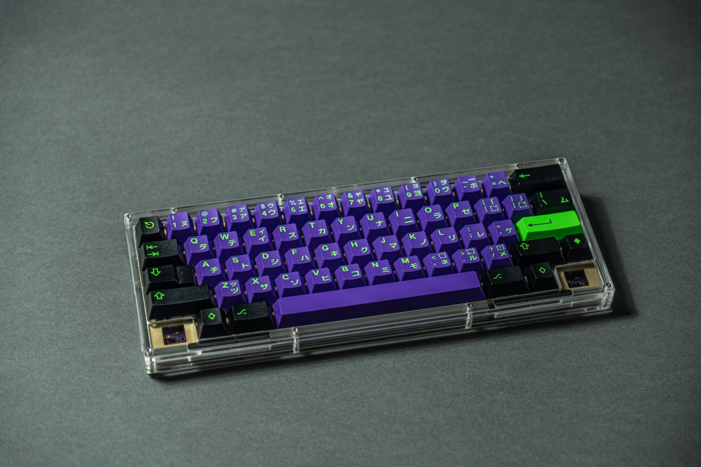
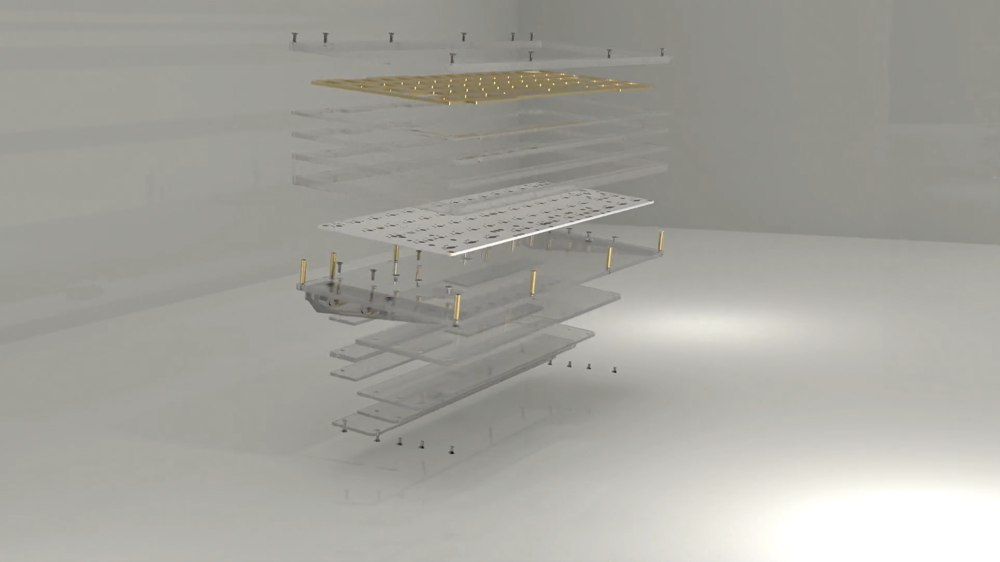
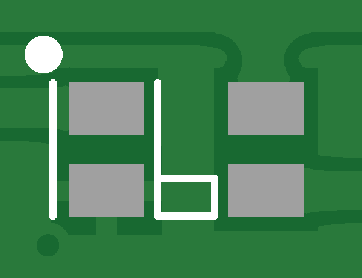
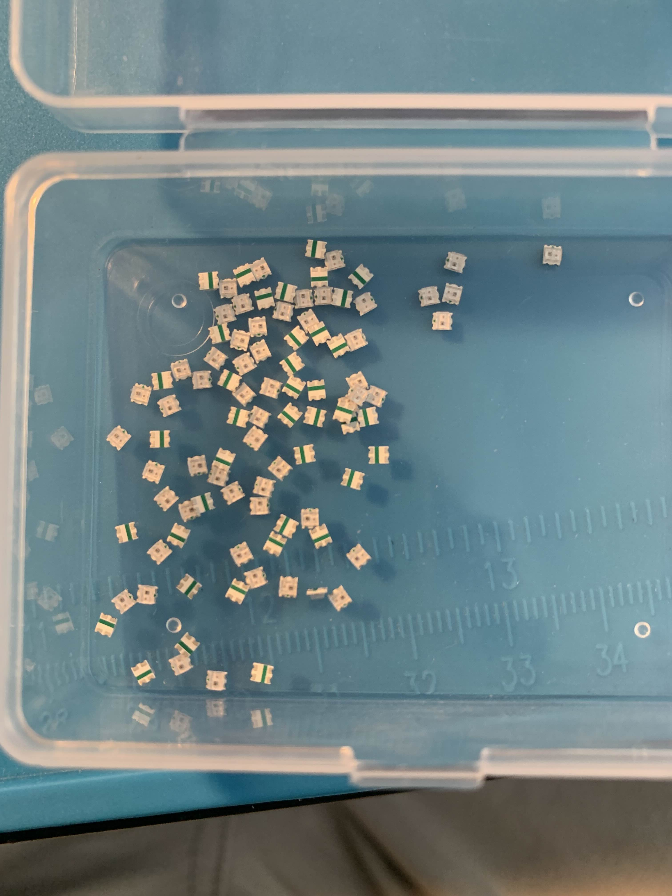

### HLB PoorKoi is a 60% stacked acrylic keyboard

# Why PoorKoi

Well it's a funny joke between a poor version of a well known 60% keyboard kit with a kohaku and also a wordplay with _Pourquoi_ a french word meaning _Why_

# Where can I buy one ?

Unfortunately PoorKoi was a private group-buy on Deltakeyco.com from July 1st to July 15th 2024.
At this time we don't share drawings of acrylic layers but plate STEP file is available.

# What can I find here ?

Here you'll find the build guide as well as the firmware for pcb. It's based on 4pplet pcb with a custom look and source code is available to match the open source license.
Firmware is matching our layout as well as options such as:
- Split backspace
- Split left shift
- Iso Enter
- Split spacebar
- WK/WKL/HHKB layout
- RGB underglow
- Capslock LED support

# Special note / Disclaimer

PCB underglow was not described in the GB and we were keeping it as a secret. After the GB, 5 people requested and extra PCB in purple and this batch was ordered with the same production file. Those 5 pcb arrived before the white ones and everything was fine.

When Deltakeyco received the white PCB we discovered underglow LED were missing. As 5 people would be able to  make pictures with underglow we decided to buy and include the missing LED in the package.

You're free to solder or ask someone to solder. Be advised this process is not so easy as parts are very tiny. Please take time to ask or watch video how to properly solder those components ! 

Ok now you are well aware of the risks, you can follow for example this documentation : [How to Solder SMD / SMT Components](https://www.instructables.com/How-to-Solder-SMD-SMT-Components-With-a-Soldering-/)
On the PCB you will find 16 spots like this one 

As you can see there is a dot and vertical line giving you the correct side for the SMD led component. When you flip it the green line must be on the same side as the dot

# So what's next ?

Next HLB's project is a TKL made of aluminum with CNC machining. It will be more expensive but others _Poor_ projects will come next.
Follow us on discord for more information here: https://discord.gg/pehBKyyYYs

