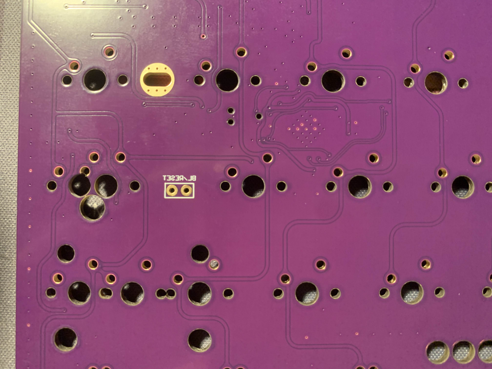

# Vial Firmware

- This folder contains the latest VIAL firmware

[PoorKoi latest firmware](https://github.com/H3lli0n/vial-qmk/releases?q=poorkoi&expanded=true)

# How-to flash

Simply use the old and well known QMK Toolbox. Use desktop version of VIAL to backup ad restore your layouts.

# Source code

- Source code is available through my fork [here](https://github.com/H3lli0n/vial-qmk/tree/HLB_PoorKoi)
- The reset button on pcb is located here and can be activated with tweezers

