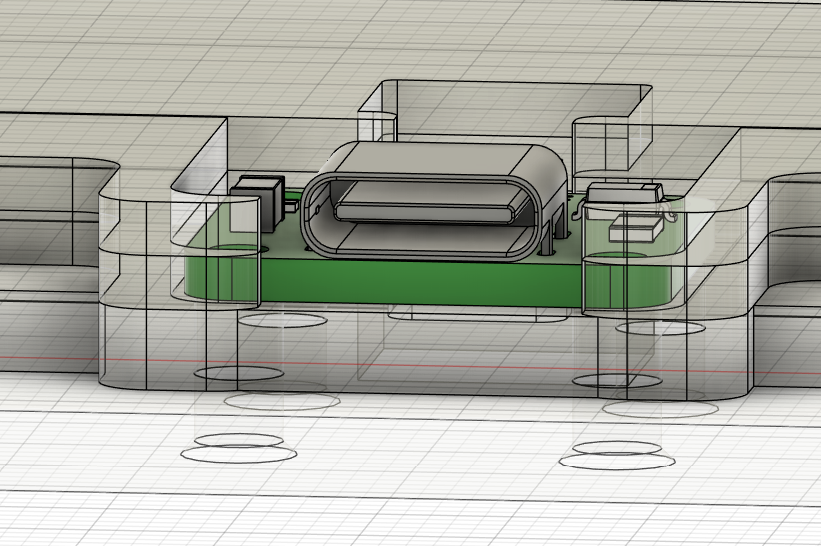
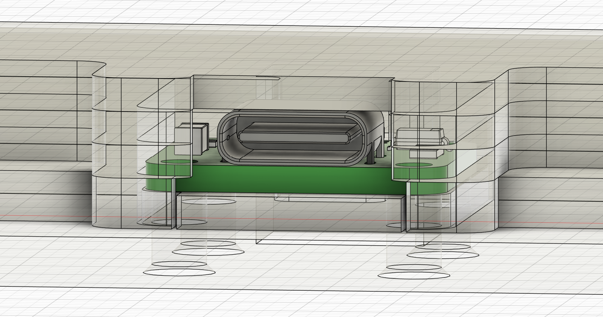

# Note sur la production au 7/10/2024

Suite aux livraisons et build du PoorKoi, des problèmes ont été rencontrés à différents niveaux. HLB est désolés de la situation, nous ne pensions pas avoir autant de soucis sur la fin de production.

Tout d'abord je tiens je vous informe que nous avons pris l'ensemble des problèmes sérieusement et assumons le SAV. Ainsi, nous avons maintenant la vision d'ensemble des soucis et lançons la mise en production dès que possible du SAV (nous sortons d'une période de vacances en Chine il y a donc du délais).

## Fixation des pieds

Un trou de fixation n'est pas axé avec la plaque principale possédant le Koi:
* modification suite au prototype
* le dessin a été mis à jour
* la plaque va être commandée pour 30 unités

## Port USB

* modification suite au prototype pour éviter de manipuler de la visserie 3mm
* effet de bord sur l'espacement avec le port usb
* erreur humaine lors des vérifications
* retour arrière sur la fixation de la daughterboard sur la base du prototype

### Avant

### Après 

Fix en cours (peut changer)

note: une communication sera réalisée sur la visserie à utiliser

## JST to molex

Comme expliqué sur le discord, la connexion initiale était JST-JST mais suite à une erreur de fichier lors de la production chez JLC, nous avons livrer des daughterboard JST-Molex et avons par conséquent commandé les câbles nécessaires avec le schéma technique officiel.

Les câbles sont arrivés avec un connecteur inversé et sommes en conversation avec l'entreprise, pour qui la production reflète le dessin; ce qui est faux.
A ce jour je suis toujours en «litige» avec eux mais vous pouvez inverser vous-même les fils (venez sur le discord pour un tuto).

=> en attente réponse entreprise

## Plate pour le ISO

Une erreur est apparue chez les utilisateurs ISO, une découpe est manquante pour le switch situé à côté du Enter ISO.
* erreur humaine lors de la mise en forme de la plate
* une plate de remplacement va être commandée pour les 30 unités et fournie dans le carton