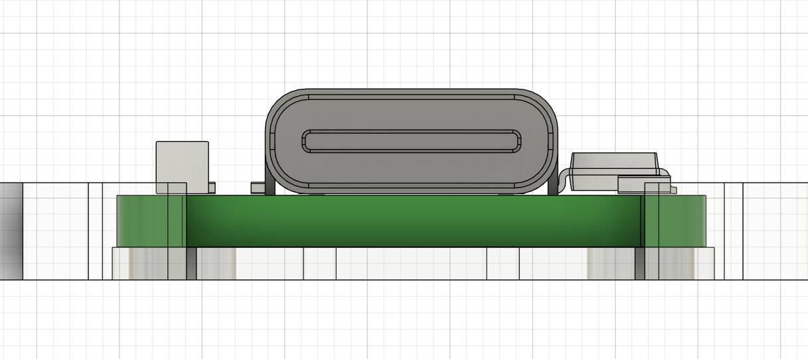

# Mise en place du sav

Le sav est en cours de production et est attendu pour la fin du mois. Concernant les corrections nous avons donc:
* La correction du trou de fixation des pieds
* Diminution du fraisage pour les vis maintenant la daughterboard
* Eléments de remplacement pour la fixation de la daughterboard
* La plate refaite pour la configuration ISO ou les personnes ayant des difficultés à insérer les vis  (taille de 14mm x 14mm au lieu de 13,9mm x 13,9mm)

# Plate

Si vous décidez de changer de plate, il vous faut de nouveaux gaskets. Voici ceux qui vous ont été livrés:
* https://fr.aliexpress.com/item/1005005171752968.html
  * Choisir 90x4x3mm white

A date le produit est out of stock. Je vous indique des liens alternatifs mais ceux-ci sont trop chers :-(
* https://fr.aliexpress.com/item/1005007081069765.html
  * Choisir 90x4x3mm white

Une autre solution est d'acheter ce rouleau multi-usages et de découper vos gaskets dedans
* https://fr.aliexpress.com/item/1005005057632486.html
  * Choisir épaisseur 3mm mais la matière est plus dense que le poron et donc moins compressible. En ce sens je privilégierai donc le 2mm ce qui peut également apporter un peu de flex général

# Fixation de la daughterboard

Pour résoudre les problèmes de la fixation de la daughterboard, je vous propose 3 solutions.
Voici les liens vers les fournitures des solutions:
* https://fr.aliexpress.com/item/1005006049595637.html	
  * Choisir M2 x 3mm
* https://fr.aliexpress.com/item/1005005974779771.html	
  * Choisir M2 x 3mm
* https://fr.aliexpress.com/item/1005003323071003.html	
  * Choisir M2 white

## Scénario 1 : taux de réussite 60%

* Réutiliser la visserie existante
* Utiliser la petite plaque de 2mm en dessous de la daughterboard
* Utiliser les oring pour compenser le 1 à 2mm perdu sur le pas de vis

Voici une illustration

## Scénario 2 : taux de réussite 80%
* Utiliser les vis fraisées M2 x 3mm commandées
* Réutiliser les entretoises 4mm
* Utiliser la plaque de 2mm en dessous de la daughterboard

La db ne serra plaquée sur le plaque avec les résidus de soudure en dessous, les vis de 3mm sont adaptées et en serrant des 2 côtés la prise de filet sera homogène.

Voici une illustration

## Scénario 3 : taux de réussite 99% :-)

Ce scénario revient à la configuration du proto. Lors du montage il a été noté que manipuler les vis de 3mm avec une entretoise de 3mm était compliqué et que la prise de filet devait être précise.
Néanmoins la daughterboard était correctement positionnée et ne bouge pas.

Pour reprendre le design original tout en ayant une marge de manoeuvre sur la prise de filet, j'ai donc demander la réalisation d'une plaque de 1mm qui va permettre de combler les écarts.

Ce scénario offre aussi le meilleur espacement entre le haut du port usb et la plaque couvrante, nous aurions dû conserver ce design.

* Utiliser les entretoises M2 x 3mm
* Utiliser les vis fraisées M2 x 3mm
* Utilliser la plaque de 1mm sous la daughterboard si nécessaire ou les oring

Voici une illustration

